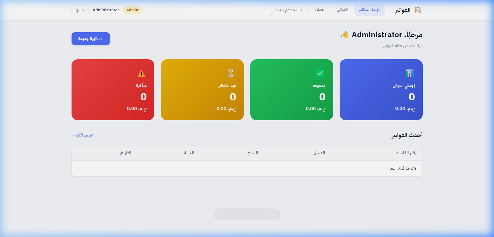
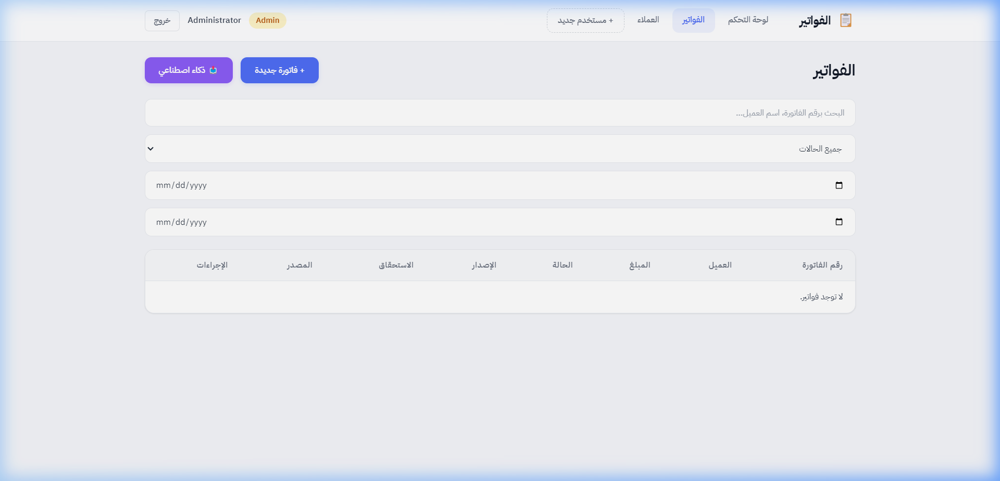
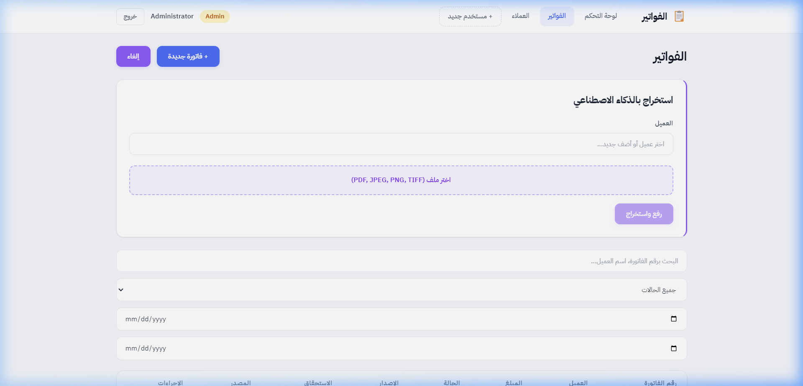
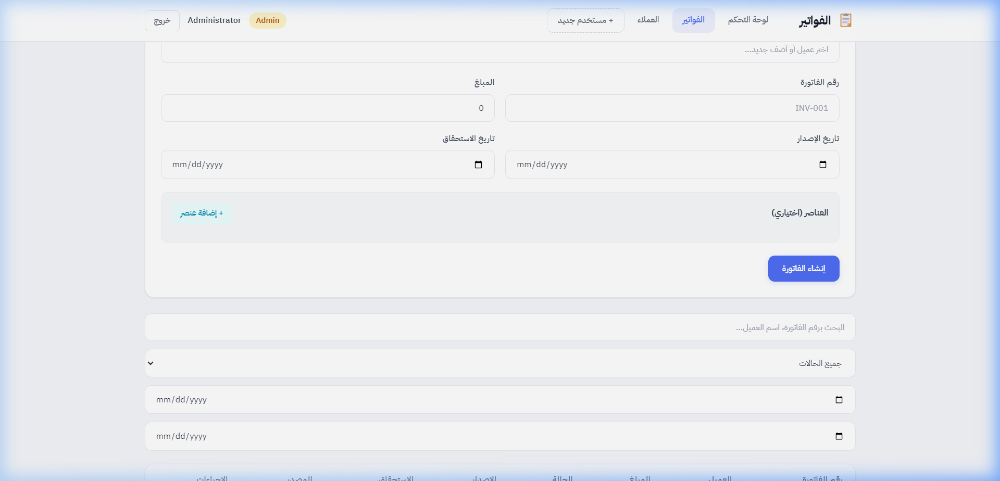
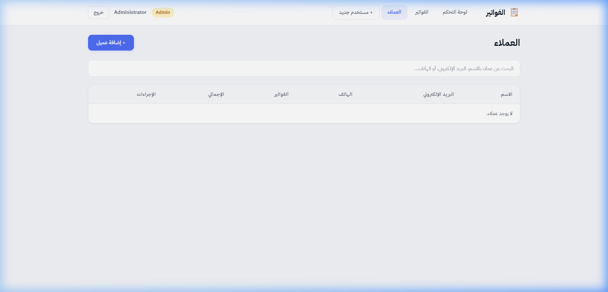

<p align="center">
  
  
  
  
  
</p>

<h1 align="center">📄 AI-Powered Invoice Management System</h1>

<p align="center">
  A full-stack invoice management platform that leverages <strong>Azure AI Document Intelligence</strong> to automatically extract data from uploaded invoice documents (PDF, JPEG, PNG, TIFF), eliminating ~80% of manual data entry.
</p>

<p align="center">
  <em>⚠️ This is a private freelance project. Source code is not publicly available.<br/>
  The README below documents the system architecture, features, and technical decisions.</em>
</p>

---

## 📸 Screenshots

<details open>
<summary><strong>🔐 Login Page</strong></summary>
<br/>
<p align="center">
  
</p>
<p align="center"><em>Premium auth page with gradient background & JWT-based authentication</em></p>
</details>

<details open>
<summary><strong>📊 Dashboard</strong></summary>
<br/>
<p align="center">
  
</p>
<p align="center"><em>Real-time stats cards (Total, Paid, Pending, Overdue) + recent invoices table</em></p>
</details>

<details open>
<summary><strong>🧾 Invoice Management</strong></summary>
<br/>
<p align="center">
  
</p>
<p align="center"><em>Full-text search, status filtering, date range filtering, pagination & CRUD operations</em></p>
</details>

<details open>
<summary><strong>🤖 AI Invoice Extraction</strong></summary>
<br/>
<p align="center">
  
</p>
<p align="center"><em>Upload a PDF/image → Azure AI extracts vendor, amount, due date & line items automatically</em></p>
</details>

<details open>
<summary><strong>✍️ Manual Invoice Creation</strong></summary>
<br/>
<p align="center">
  
</p>
<p align="center"><em>Create invoices manually with client selector, line items, and auto-calculated totals</em></p>
</details>

<details open>
<summary><strong>👥 Client Management</strong></summary>
<br/>
<p align="center">
  
</p>
<p align="center"><em>Full CRUD for clients with search, edit, delete, and per-client invoice count & totals</em></p>
</details>

---

## ✨ Key Features

| Category | Features |
|---|---|
| **🤖 AI Extraction** | Upload PDF/JPEG/PNG/TIFF → Azure Form Recognizer extracts vendor name, amount, due date, invoice number & line items automatically |
| **📊 Dashboard** | Real-time financial overview with stats cards (total, paid, pending, overdue) + recent invoices |
| **🧾 Invoice CRUD** | Create invoices manually with line items, mark as Paid/Overdue/Cancelled, view detailed breakdowns |
| **👥 Client Management** | Full CRUD for clients with inline creation from invoice form, search & pagination |
| **🔍 Advanced Search** | Full-text search by invoice number or client name, filter by status, date range, and client |
| **📄 Pagination** | Server-side pagination with configurable page sizes for both invoices and clients |
| **🔐 Authentication** | JWT-based auth with role-based access control (Admin / User roles) |
| **👤 Admin Features** | Admin-only status updates, user registration, and delete operations |
| **☁️ Cloud Storage** | Invoice documents stored in Azure Blob Storage with secure access |
| **📱 Responsive** | Fully responsive RTL (Arabic) UI with mobile hamburger navigation |

---

## 🏗️ Architecture

The system follows **Clean Architecture** principles with clear separation of concerns:

```
┌──────────────────────────────────────────────────────────────────┐
│                        PRESENTATION                              │
│                                                                  │
│   ┌──────────────────────┐    ┌──────────────────────────────┐   │
│   │   Angular 19 SPA     │    │   ASP.NET Core Web API       │   │
│   │   (Standalone Comp.) │◄──►│   (REST Controllers)         │   │
│   │   + Auth Guard       │    │   + JWT Authentication       │   │
│   │   + HTTP Interceptor │    │   + Swagger/OpenAPI          │   │
│   └──────────────────────┘    └──────────────┬───────────────┘   │
│                                              │                   │
├──────────────────────────────────────────────┼───────────────────┤
│                    APPLICATION               │                   │
│                                              ▼                   │
│   ┌──────────────────────────────────────────────────────────┐   │
│   │   Command Handlers    │    Query Handlers                │   │
│   │   • CreateInvoice     │    • SearchInvoices (paginated)  │   │
│   │   • UploadInvoice     │    • GetInvoiceById              │   │
│   │   • UpdateStatus      │    • GetDashboard (aggregated)   │   │
│   │   • CreateClient      │    • SearchClients               │   │
│   │   + Validators        │    • GetClientById               │   │
│   └──────────────────────────────────────────────────────────┘   │
│                              │                                   │
├──────────────────────────────┼───────────────────────────────────┤
│                    DOMAIN    │                                    │
│                              ▼                                   │
│   ┌──────────────────────────────────────────────────────────┐   │
│   │   Entities: Invoice, Client, User, InvoiceLineItem       │   │
│   │   Enums: InvoiceStatus (Pending, Paid, Overdue, Cancel.) │   │
│   │   Interfaces: IInvoiceRepository, IClientRepository,     │   │
│   │               IBlobStorageService, IInvoiceExtraction... │   │
│   └──────────────────────────────────────────────────────────┘   │
│                              │                                   │
├──────────────────────────────┼───────────────────────────────────┤
│                 INFRASTRUCTURE                                   │
│                              ▼                                   │
│   ┌──────────────────────────────────────────────────────────┐   │
│   │   EF Core + PostgreSQL  │  Azure Blob Storage            │   │
│   │   Repository Pattern    │  Azure Form Recognizer (AI)    │   │
│   │   JWT Token Service     │  Auto-Migrations on Startup    │   │
│   └──────────────────────────────────────────────────────────┘   │
└──────────────────────────────────────────────────────────────────┘
```

---

## 🔧 Tech Stack

### Backend
| Technology | Purpose |
|---|---|
| **.NET 8** | Web API framework |
| **ASP.NET Core** | REST API with controllers |
| **Entity Framework Core** | ORM with code-first migrations |
| **PostgreSQL 16** | Primary database |
| **JWT Bearer** | Authentication & authorization |
| **Azure Form Recognizer** | AI-powered document data extraction |
| **Azure Blob Storage** | Cloud document storage |
| **Swagger / OpenAPI** | Interactive API documentation |

### Frontend
| Technology | Purpose |
|---|---|
| **Angular 19** | SPA framework (standalone components) |
| **RxJS** | Reactive state & HTTP management |
| **TypeScript 5.7** | Type-safe development |

### DevOps
| Technology | Purpose |
|---|---|
| **Docker** | Multi-stage containerized builds |
| **Docker Compose** | One-command local orchestration (API + PostgreSQL) |
| **Vercel** | Frontend deployment |

---

## 📡 API Endpoints

### Authentication
| Method | Endpoint | Description | Auth |
|---|---|---|---|
| `POST` | `/api/auth/register` | Register a new user | Admin |
| `POST` | `/api/auth/login` | Login & receive JWT | Public |

### Invoices
| Method | Endpoint | Description | Auth |
|---|---|---|---|
| `GET` | `/api/invoices` | List all invoices | User |
| `GET` | `/api/invoices/search` | Search, filter & paginate | User |
| `GET` | `/api/invoices/dashboard` | Aggregated statistics | User |
| `GET` | `/api/invoices/{id}` | Get invoice details | User |
| `POST` | `/api/invoices` | Create invoice manually | User |
| `POST` | `/api/invoices/upload` | Upload file → AI extraction | User |
| `PATCH` | `/api/invoices/{id}/status` | Update status | Admin |

### Clients
| Method | Endpoint | Description | Auth |
|---|---|---|---|
| `GET` | `/api/clients` | List all clients | User |
| `GET` | `/api/clients/search` | Search & paginate clients | User |
| `GET` | `/api/clients/{id}` | Get client details | User |
| `POST` | `/api/clients` | Create a client | User |
| `PUT` | `/api/clients/{id}` | Update a client | Admin |
| `DELETE` | `/api/clients/{id}` | Delete a client (no invoices) | Admin |

---

## 🗂️ Project Structure

```
InvoiceApi/
├── src/
│   ├── InvoiceApi.API/              # Presentation layer
│   │   ├── Controllers/
│   │   │   ├── AuthController.cs         # Login & register
│   │   │   ├── InvoicesController.cs     # Invoice CRUD + AI upload
│   │   │   └── ClientsController.cs      # Client management
│   │   └── Program.cs                    # App configuration & middleware
│   │
│   ├── InvoiceApi.Application/      # Business logic layer
│   │   ├── Auth/Commands/                # Register & login handlers
│   │   ├── Invoices/
│   │   │   ├── Commands/                 # Create, Upload, UpdateStatus
│   │   │   ├── Queries/                  # Search, GetById, Dashboard
│   │   │   └── Validators/              # Input validation
│   │   ├── Clients/
│   │   │   ├── Commands/                 # Create, Update, Delete
│   │   │   └── Queries/                  # Search, GetById
│   │   └── DTOs/                         # Data transfer objects
│   │
│   ├── InvoiceApi.Domain/           # Core domain layer
│   │   ├── Entities/
│   │   │   ├── Invoice.cs                # Rich domain model with behavior
│   │   │   ├── Client.cs
│   │   │   ├── InvoiceLineItem.cs
│   │   │   └── User.cs
│   │   ├── Enums/InvoiceStatus.cs
│   │   └── Interfaces/                   # Repository & service contracts
│   │
│   └── InvoiceApi.Infrastructure/   # External concerns
│       ├── Persistence/AppDbContext.cs
│       ├── Repositories/                 # EF Core implementations
│       ├── Services/
│       │   ├── FormRecognizerService.cs  # Azure AI integration
│       │   ├── BlobStorageService.cs     # Azure Blob Storage
│       │   └── TokenService.cs          # JWT generation
│       └── Migrations/
│
├── client/                          # Angular 19 SPA
│   └── src/app/
│       ├── dashboard/                    # Stats overview page
│       ├── invoices/                     # Invoice list + AI upload
│       ├── clients/                      # Client management
│       ├── login/                        # Authentication page
│       ├── register/                     # User registration (admin)
│       ├── auth.service.ts               # JWT token management
│       ├── auth.guard.ts                 # Route protection
│       ├── auth.interceptor.ts           # Auto-attach JWT to requests
│       ├── api.service.ts                # Centralized HTTP calls
│       └── models.ts                     # TypeScript interfaces
│
├── tests/                           # Unit & integration tests
├── Dockerfile                       # Multi-stage .NET build
├── docker-compose.yml               # API + PostgreSQL orchestration
└── InvoiceApi.sln                   # Solution file
```

---


---

## 🔐 Security

- **JWT Bearer Authentication** — Stateless token-based auth with configurable expiration
- **Role-Based Access Control** — Admin vs User roles with `[Authorize(Roles = "Admin")]`
- **Password Hashing** — Secure credential storage
- **CORS Policy** — Configured for frontend origins
- **File Validation** — Strict type (PDF, JPEG, PNG, TIFF) and size (10MB) limits
- **Input Validation** — Server-side validation on all command handlers

---


## 📈 Impact

| Metric | Value |
|---|---|
| 📄 Invoices processed | **100+ / month** |
| ⏱️ Manual entry time reduced | **~80%** via AI extraction |
| 🤖 AI extraction fields | **5+** (vendor, amount, date, number, line items) |
| 📁 Supported file types | **4** (PDF, JPEG, PNG, TIFF) |
| 🏗️ Architecture layers | **4** (Clean Architecture) |
| ☁️ Azure services integrated | **2** (Blob Storage + Form Recognizer) |
| 📡 REST API endpoints | **14** |
| 🔐 Auth system | JWT + RBAC (Admin/User) |

---

## 👤 Author

**Ahmed Medhat**

- This project was built as a freelance engagement for a client requiring automated invoice processing
- Source code is private per client agreement

---

<p align="center">
  <em>Built with .NET 8, Angular 19, Azure AI, and ☕</em>
</p>
